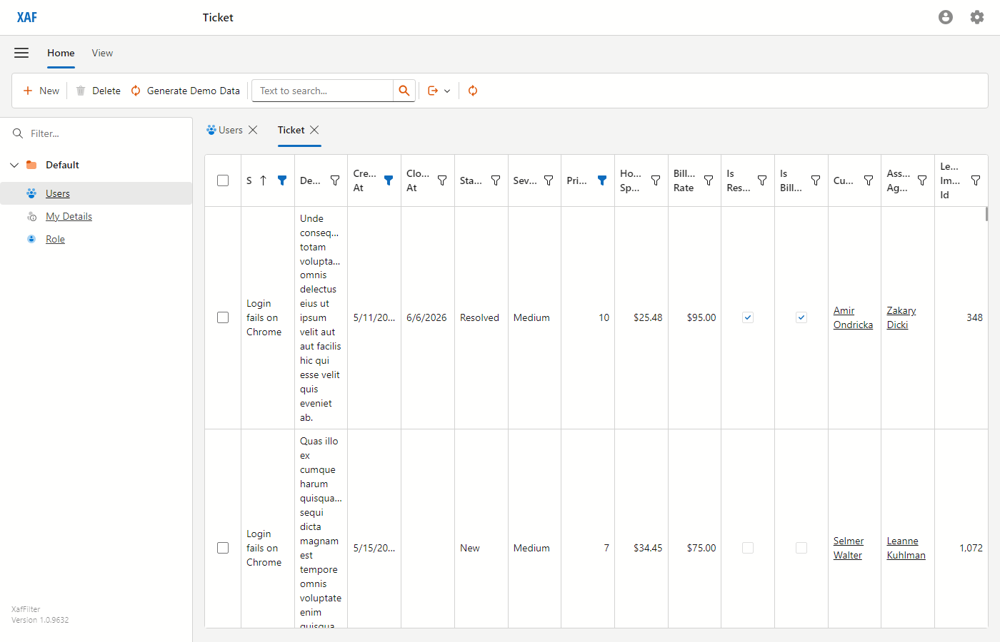
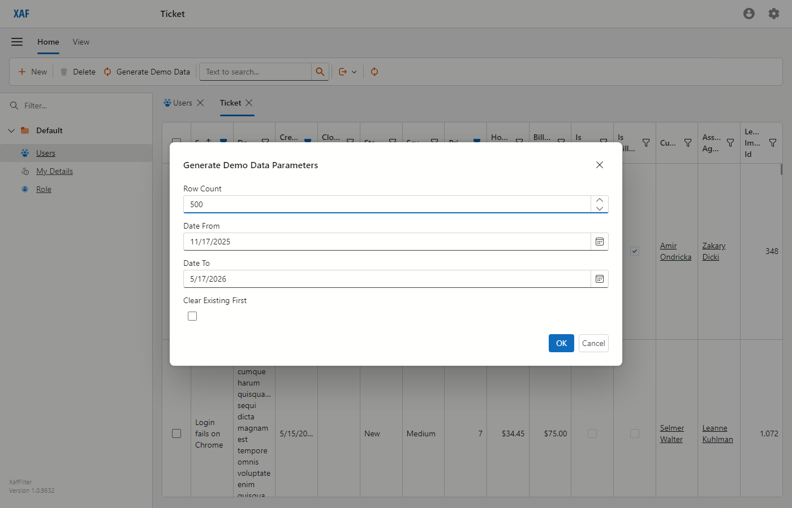
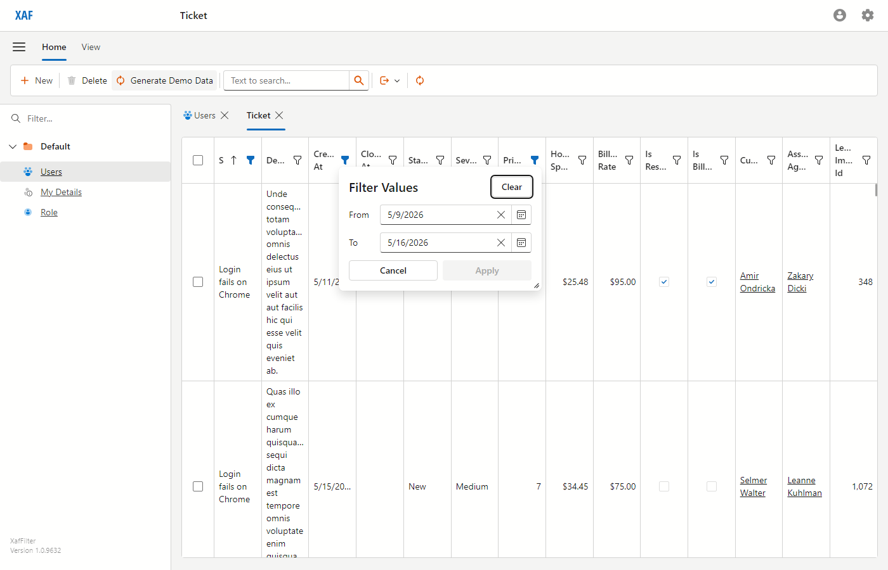
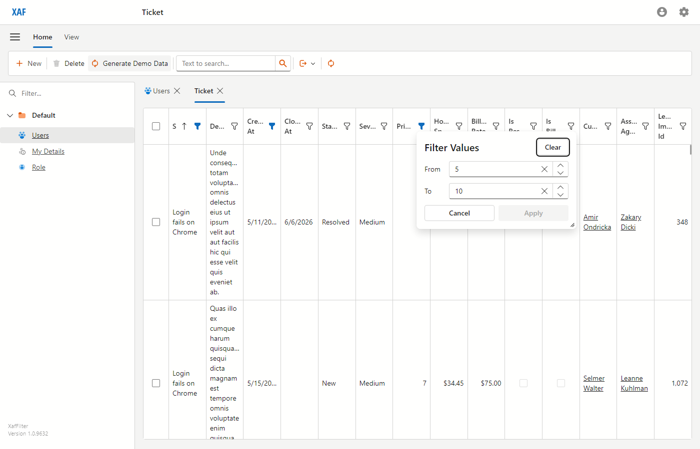
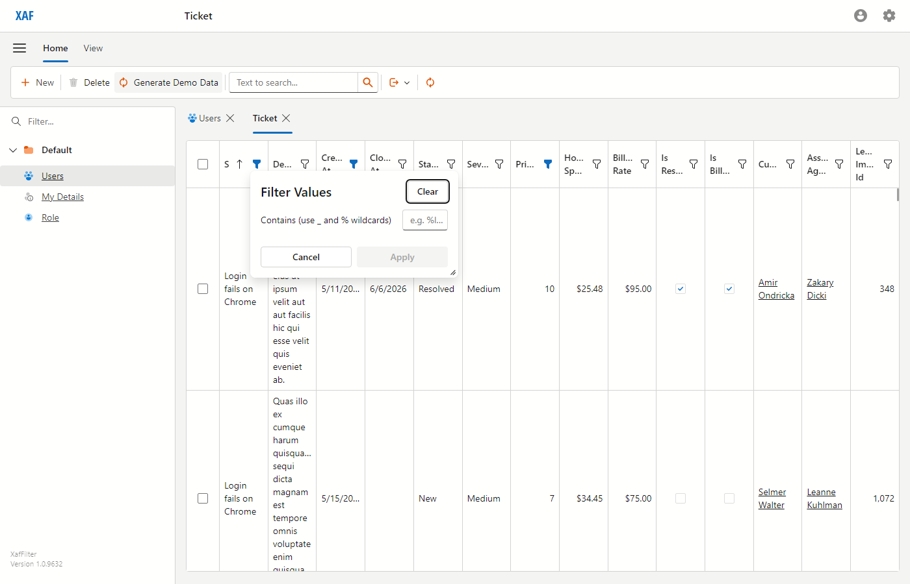
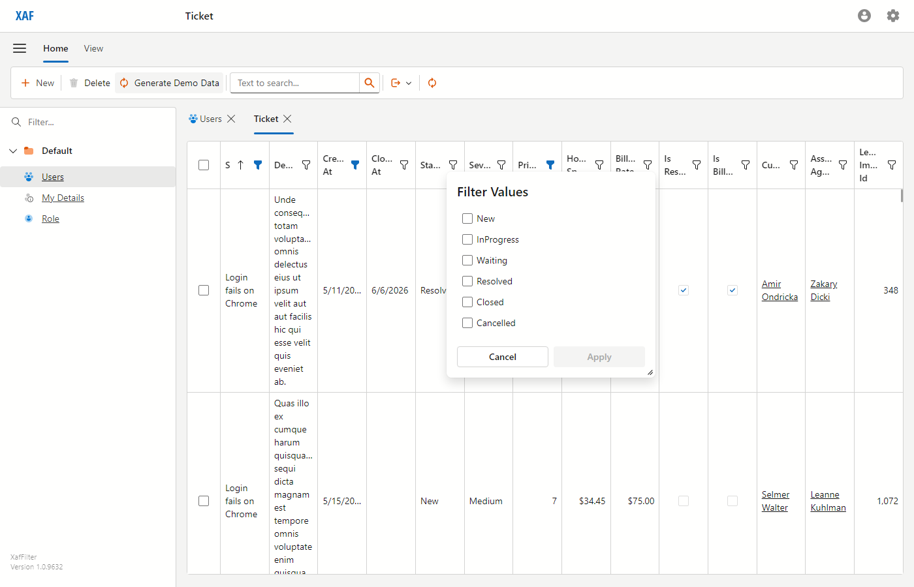
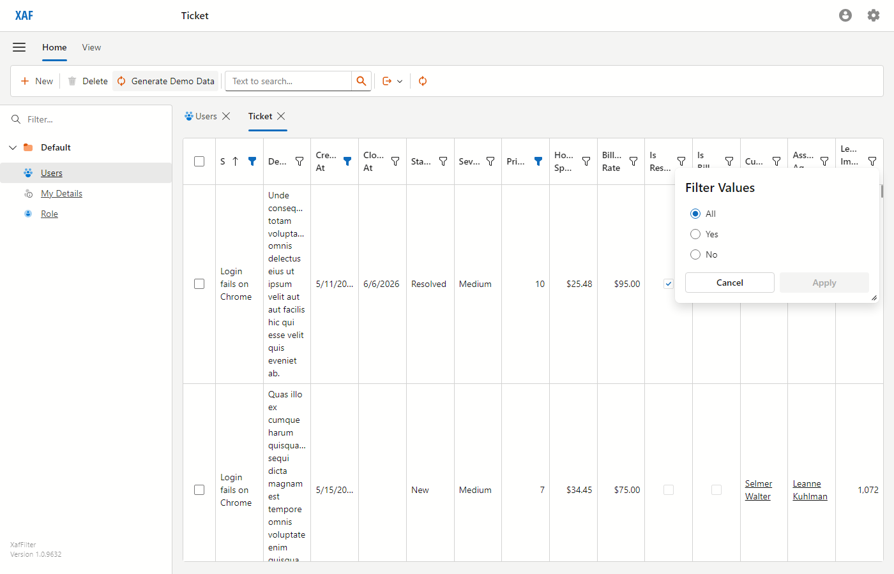
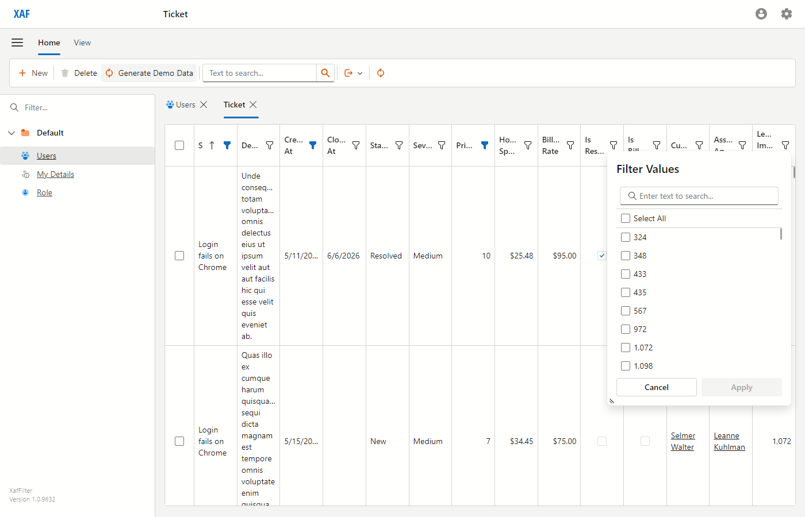

# XafFilter

Custom column-filter UI for DevExpress XAF (Blazor Server) — five drop-in filter menus that replace the default DevExpress filter dropdown on a per-column-type basis, plus a fully tested demo app to prove they work.

The eventual deliverable is a reusable filter / query-builder library that drops into any XAF application; this repo is the proving ground.

| | |
|---|---|
| **Stack** | .NET 10, DevExpress XAF 25.2.5 (Blazor Server), EF Core 10, SQL Server LocalDB |
| **Tests** | 55 xUnit (criteria builders + demo seeder, sub-second) + 9 Playwright (Blazor + filter UI, ~80s) |
| **Build configurations** | `Debug`, `Release`, **`EasyTest`** (auto-creates a separate `XafFilterEasyTest` DB — used by the Playwright fixture) |

---

## What's in the box

Five custom column-filter menus, automatically wired by column member type:

| Filter                       | Targets                                              | UI                                           |
|------------------------------|------------------------------------------------------|----------------------------------------------|
| `DateRangeFilterMenu`        | `DateTime`, `DateOnly`                               | Two `DxDateEdit` (From / To)                 |
| `NumericRangeFilterMenu`     | All numeric types (`int`, `decimal`, `double`, ...)  | Two `DxSpinEdit` with `N0` / `N2` format     |
| `WildcardStringFilterMenu`   | `string`                                             | Single `DxTextBox` accepting `_` and `%`     |
| `EnumMultiSelectFilterMenu`  | enum types                                           | `DxListBox` with one checkbox per enum value |
| `BoolTriStateFilterMenu`     | `bool`                                               | `DxRadioGroup` with All / Yes / No           |

Plus a `[DisableCustomFilter]` opt-out attribute for fields where the type-based heuristic picks the wrong filter (ID columns, legacy import keys, etc.).

---

## Screenshots

A guided tour through the demo app's Ticket ListView.

### Seeded support-ticket list

`Ticket` is the demo BO; `Customer` and `Agent` are referenced from it. The seeder uses [Bogus](https://github.com/bchavez/Bogus) with a deterministic `Randomizer.Seed = new Random(42)`, so each row count produces the same data every run.



### Generate Demo Data (popup parameters object)

The `Generate Demo Data` toolbar action is a `PopupWindowShowAction` on the Ticket `ListView`. It collects a row count + date range + clear-first flag via a `[DomainComponent]` non-persistent BO, then runs the seeder in a fresh `IObjectSpace` and refreshes the view.



### DateRange filter — `Created At` column

Click any column's funnel icon to open the filter menu. For `DateTime` / `DateOnly` columns the menu becomes a From/To date-range picker.



### NumericRange filter — `Priority` column

Numeric columns get a From/To `DxSpinEdit` pair. Integer columns use `N0` format, floating-point types use `N2`.



### WildcardString filter — `Subject` column

String columns get a single text input that accepts SQL `LIKE` wildcards (`_` for one char, `%` for many).



### Enum multi-select — `Status` column

Enum columns render a `DxListBox` with a checkbox per value. Empty or all-selected = no filter.



### Bool tri-state — `Is Resolved` column

`bool` columns get a three-way radio: `All` clears the filter; `Yes` and `No` filter to `true` / `false`.



### Opt-out — `Legacy Import Id` column

`Ticket.LegacyImportId` is decorated with `[DisableCustomFilter]`, so the default DevExpress filter menu (Select All + checkbox list) appears instead of the custom `NumericRangeFilterMenu`.



---

## How it works — the 5-step contract

Every custom filter follows the same lifecycle:

1. **`Controller.OnActivated`** subscribes to `View.ControlsCreated`.
2. **`Controller.View_ControlsCreated`** iterates `editor.GridDataColumnModels` on the `DxGridListEditor`, skips columns whose `MemberType` doesn't match this filter or whose property is marked `[DisableCustomFilter]`, then sets `FilterMenuButtonDisplayMode = Always` and assigns a `FilterMenuTemplate` that renders the Razor component.
3. **`Razor.OnParametersSet`** calls a `CriteriaBuilders.ReadXxx` helper to recover the current inputs from `FilterContext.FilterCriteria`.
4. **`Razor.OnInputChanged`** calls `CriteriaBuilders.BuildXxx` and writes the result back to `FilterContext.FilterCriteria`. The grid re-filters on every input change — the popup's Apply button stays disabled because there are no pending criteria; the popup closes via Cancel or click-outside.
5. **`Controller.OnDeactivated`** unsubscribes `ControlsCreated`.

All criteria construction lives in [`XafFilter.Module/Filters/CriteriaBuilders.cs`](XafFilter/XafFilter.Module/Filters/CriteriaBuilders.cs) — pure helpers, no Blazor dependency, fully unit-testable.

The Razor components and their controllers are in [`XafFilter.Blazor.Server/Filters/`](XafFilter/XafFilter.Blazor.Server/Filters/) — paired by name (`DateRangeFilterMenu.razor` + `DateRangeFilterMenuController.cs`).

---

## Repository layout

```
XafFilter/
├── XafFilter.slnx                          ← solution file (new XML format)
├── XafFilter/
│   ├── XafFilter.Module/                   ← business objects, criteria builders
│   │   ├── BusinessObjects/Demo/           ← Customer, Agent, Ticket, GenerateDemoDataParameters
│   │   ├── Controllers/                    ← GenerateDemoDataController (platform-agnostic)
│   │   ├── DemoData/DemoDataSeeder.cs      ← Bogus-powered deterministic seeder
│   │   ├── Filters/
│   │   │   ├── CriteriaBuilders.cs         ← Build/Read pair per filter type
│   │   │   └── DisableCustomFilterAttribute.cs
│   │   └── Module.cs, XafFilterDbContext.cs
│   ├── XafFilter.Blazor.Server/            ← host
│   │   ├── Filters/
│   │   │   ├── Components/*.razor          ← five filter Razor components
│   │   │   └── Controllers/*.cs            ← five Blazor-side controllers
│   │   ├── Startup.cs, Program.cs, BlazorApplication.cs
│   │   └── appsettings.json                ← LocalDB connection + EasyTest connection
│   ├── XafFilter.Module.Tests/             ← xUnit — criteria builders, seeder
│   └── XafFilter.Blazor.Server.Tests/      ← Playwright — smoke + filter UI + theme
└── docs/
    ├── superpowers/plans/                  ← implementation plan that drove this work
    └── screenshots/                        ← README screenshots
```

---

## Running locally

Prerequisites:

- .NET 10 SDK
- SQL Server LocalDB (the Visual Studio installer's "Data storage and processing" workload, or stand-alone LocalDB installer)
- A trusted ASP.NET Core dev certificate: `dotnet dev-certs https --trust`

Start the host:

```powershell
dotnet run --project XafFilter/XafFilter.Blazor.Server
```

The first run creates the `XafFilter` LocalDB database via `Updater.cs` when launched **under a debugger** (Visual Studio F5). From the CLI without a debugger, use the `EasyTest` configuration — it always runs the updater and points at the separate `XafFilterEasyTest` catalog:

```powershell
dotnet run --project XafFilter/XafFilter.Blazor.Server -c EasyTest
```

Then open `https://localhost:5001` and log in as `Admin` (blank password). Navigate to **Ticket** via direct URL (`https://localhost:5001/Ticket_ListView`) and click **Generate Demo Data** to seed.

> **Demo BO nav items** are intentionally not in the side menu — the project's focus is the filter UI, not the demo CRUD. URL-route directly to `/Ticket_ListView`.

---

## Adding a new business object

Two things must happen or the type silently fails to appear in the XAF model:

1. Add a `DbSet<T>` to `XafFilter.Module/BusinessObjects/XafFilterDbContext.cs`.
2. Add `AdditionalExportedTypes.Add(typeof(T));` to the `XafFilterModule` constructor in `Module.cs`.

And for navigation collections, **always** use `ObservableCollection<T>`, not `List<T>` — XAF's `ChangingAndChangedNotificationsWithOriginalValues` change-tracking strategy requires `INotifyCollectionChanged`. `List<T>` compiles and even unit-tests fine (the in-memory test DbContext uses a different strategy) but throws at `CreateObject<T>()` runtime in the real app. This bit `Customer.Tickets` and `Agent.AssignedTickets` once — see commit `c987aea`.

---

## Tests

```powershell
# Unit tests — criteria Build/Read round-trips + DemoDataSeeder. ~1s.
dotnet test XafFilter/XafFilter.Module.Tests

# Playwright tests — login + filter UI rendering + light-theme. ~80s.
# First run downloads Chromium to ~/.cache/ms-playwright/.
dotnet test XafFilter/XafFilter.Blazor.Server.Tests

# Everything.
dotnet test XafFilter.slnx
```

### How the Playwright fixture works

`AppFixture` spawns `dotnet run -c EasyTest --no-launch-profile --urls=http://localhost:5000` from the test process, with `ASPNETCORE_ENVIRONMENT=Development` forced. The fixture then polls `GET /LoginPage` until it returns 200, opens Chromium headless, and exposes a `NewLoggedInContextAsync()` helper for individual tests.

Reasons for the non-obvious choices:

- **HTTP/5000, not HTTPS/5001** — the default Blazor Server SignalR connection over `wss://` fails its handshake against the untrusted dev cert in headless Chromium, even with `IgnoreHTTPSErrors = true` on the browser context. The Blazor circuit never starts, the page stays on the XAF splash logo. HTTP avoids the entire problem.
- **`ASPNETCORE_ENVIRONMENT=Development` explicit** — without `--launch-profile` the host defaults to `Production`, which makes `UseStaticWebAssets()` skip the `_content` manifest, and `blazor.server.js` 404s.
- **`-c EasyTest`** — the `DatabaseVersionMismatch` handler in `BlazorApplication.cs` only auto-runs the `Updater` when the EASYTEST symbol is defined or a debugger is attached.

### Refreshing README screenshots

The screenshots in `docs/screenshots/` are generated by [`ReadmeScreenshots.cs`](XafFilter/XafFilter.Blazor.Server.Tests/Themes/ReadmeScreenshots.cs). It's `[Skip]`'d by default — un-skip it, run the test once, then put the skip back.

---

## Claude Code skills shipped with this repo

This project was implemented with [Claude Code](https://claude.com/claude-code) and several project-local skills live under `.claude/skills/`:

- **`/run-xaf`** — starts/stops the Blazor host with a port-free check + HTTP health probe.
- **`/xaf-filter-notes`** — domain reference for filter / criteria-editor work in XAF, including the 5-step contract documented above and the `[DisableCustomFilter]` opt-out pattern.

User-global skills also used heavily:

- **`xaf-efcore-entities`** — the XAF EF Core authoring rules (virtual properties, `ObservableCollection`, decimal precision, `[Aggregated]` cascade, etc.).
- **`xaf-viewcontroller-patterns`** — controller lifecycle, BoolList `Active` / `Enabled`, `PopupWindowShowAction` patterns.

---

## License

Private — internal project, no public license.
